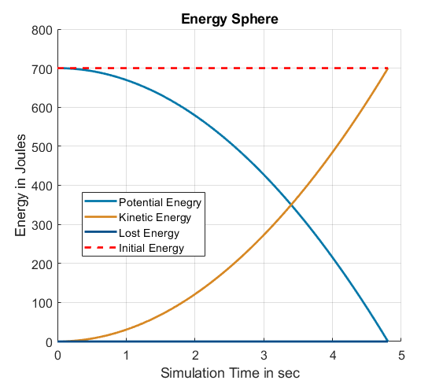

## Model Objects Rolling Down a Ramp with Simscape Multibody
The model simulates four objects (a sphere, a hollow sphere, a cylinder, and a hollow cylinder) moving down a ramp. These four objects have been selected because they have very similar geometrical properties, but can have very different inertias. The objects have been modeled with the intention of isolating inertia as the primary variable affecting their motion down the ramp. All objects have the same radius and mass, but differ in their inertias. This approach allows for a focused exploration of how mass distribution within an object influences its rolling behavior. 

## Model Overview
 Once the model is open, you can perform different modifications (such as activating or deactivating friction) by clicking on the links provided in the model canvas.

### Solid Object Model
Depending on what you are making, it can be a good idea to include screenshots or even a video (you'll frequently see GIFs rather than actual videos). Tools like ttygif can help, but check out Asciinema for a more sophisticated method.

### Contact Model
The contact between the objects and the ramp is modeled using a Spatial Contact Force block. The block calculates a friction force based on the reaction force of the ramp (it is also possible to deactivate the friction force if desired). Additionally, stiffness and damping values are provided in the block that are used to determine how the objects are deformed due to their reaction force. Finally, the subsystem Calculate Energy logs the contact variables and estimates the energy lost in the contact between objects and ramp.

### Parametrization
The model is parametrized with the script [simpleInertiaModelParam.mlx](scripts/simpleInertiaModelParam.mlx). In the script, you can change the dimensions of the ramp and of the objects, as well as their mass and color. Once the simulation is started, the objects will start moving along the ramp. The simulation automatically stops as soon as the first object has reached the edge of the ramp. You can decide whether to simulate the model with or without friction by clicking on the links provided in the model canvas. If friction is activated, the friction force will apply a torque to the objects, inducing them to roll. In this case, the inertia will have an impact on how the objects' motion. If friction is deactivated, there is no force building a torque. Consequently, the objects will simply slide along the ramp. As they are sliding and not rolling, the inertia will not impact their movement.

## Visuals
After simulating the model, you can analyze the motion of the objects as they roll or slide along the ramp. The links in the model canvas can be clicked to activate different post-processing functionalities.

### Analyze Results: Position over time
The function [visualizeHeight](scripts/visualizeHeight.m) plots the height of the objects' center of mass over time and generates a plot like the one shown below (in the reference system used in this model the height is zero at the edge of the ramp). In the example below, friction was active and the object with the smallest inertia (the sphere) reaches the edge of the ramp first. Consequently, when the simulation stops, the sphere has the lowest value (actually corresponding to the height at the ramp edge - which is zero as stated above - plus the radius of the sphere).

### Analyze Results: Energy over time
Since all four objects have the same mass, they will also have the same potential energy at the beginning of the simulation (provided that they are placed at the same height). With the function <matlab:open('visualizeEnergy'); visualizeEnergy> (which can also be called from the model canvas), you can analyze the object's energy over time.

As the objects roll along the ramp, their potential energy decreases and is converted into kinetic energy. Depending on the parametrization, some energy will also be lost due to the contact damping with the ramp. The script plots an overview of the energy components for each object so that you can analyze how energy is converted as the objects roll or slide along the ramp.

## Installation
This model was built in MATLAB&reg; R2024a and requires the following products:
- MATLAB&reg;
- Simulink&reg;
- Simscape&trade;
- Simscape&trade; Multibody&trade;

## Authors and acknowledgment
Lorenzo Nicoletti, [LinkedIn](https://www.linkedin.com/in/lorenzonicolettiphd/)
